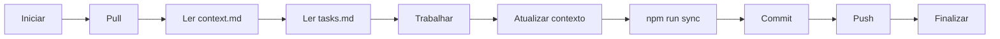

# Sistema de Sincronização de Contexto 🔄

Sistema para trabalhar de forma contínua entre **GitHub Copilot Chat** (mobile/web) e **VS Code Copilot** (desktop).

## 🎯 Objetivo

Permitir que você trabalhe no projeto de qualquer lugar, mantendo o contexto sincronizado entre diferentes ferramentas de IA.

## 📁 Estrutura de Arquivos

```
.copilot/
├── README.md           # Este arquivo - Guia de uso
├── context.md          # 📍 CONTEXTO ATUAL - O que estamos fazendo
├── tasks.md            # ✅ TAREFAS - Lista de afazeres e progresso
├── decisions.md        # 🎯 DECISÕES - Por que escolhemos X ou Y
├── memory.md           # 🧠 MEMÓRIA - Padrões e convenções
├── sync.sh             # Script de sincronização (Linux/Mac)
├── sync.ps1            # Script de sincronização (Windows)
└── package.json        # Scripts npm

.github/
└── copilot-instructions.md  # 📚 Instruções globais para Copilot

.vscode/
└── copilot-custom.md   # 🎨 Instruções específicas do workspace
```

## 🚀 Como Usar

### 1️⃣ Primeira Vez - Setup

Nada a fazer! Os arquivos já estão criados e configurados.

### 2️⃣ Trabalhando no VS Code (Desktop)

**Ao iniciar:**
1. Abra o projeto no VS Code
2. O Copilot lerá automaticamente:
   - `.github/copilot-instructions.md`
   - `.vscode/copilot-custom.md`
3. Você deve ler:
   - `.copilot/context.md` - Para saber onde parou
   - `.copilot/tasks.md` - Para ver tarefas pendentes

**Durante trabalho:**
- Use Copilot normalmente para sugestões
- Consulte `.copilot/memory.md` para padrões
- Marque tarefas como concluídas em `.copilot/tasks.md`

**Ao finalizar:**
1. Atualize `.copilot/context.md` com estado atual
2. Marque tarefas em `.copilot/tasks.md`
3. Execute sync: `npm run sync` (ou `npm run sync:win` no Windows)
4. Commit tudo incluindo arquivos de contexto
5. Push para GitHub

### 3️⃣ Trabalhando no GitHub Copilot Chat (Mobile/Web)

**Ao iniciar:**
1. Peça ao Copilot para ler `.copilot/context.md`
2. Peça para ler `.copilot/tasks.md`
3. Continue de onde parou!

**Durante trabalho:**
- O Copilot Chat lerá os arquivos de contexto conforme necessário
- Faça commits frequentes

**Ao finalizar:**
1. Peça ao Copilot para atualizar `.copilot/context.md`
2. Peça para atualizar `.copilot/tasks.md` marcando tarefas concluídas
3. Commit e push

### 4️⃣ Alternando Entre Ambientes

**Do VS Code → GitHub Chat:**
```bash
# 1. Atualize contexto
vim .copilot/context.md  # Descreva o que está fazendo

# 2. Sincronize
npm run sync

# 3. Commit
git add .
git commit -m "feat: [descrição do que fez]"
git push

# ✅ Pronto! Continue no GitHub Chat
```

**Do GitHub Chat → VS Code:**
```bash
# 1. Pull mudanças
git pull

# 2. Leia contexto
cat .copilot/context.md
cat .copilot/tasks.md

# ✅ Pronto! Continue no VS Code
```

## 📋 Arquivos de Contexto - Quando Usar

### `context.md` - Contexto Atual
**Atualize quando:**
- Mudar de foco (ex: pedidos → financeiro)
- Completar uma feature importante
- Encontrar bloqueios ou problemas
- Fazer decisões técnicas
- Finalizar sessão de trabalho

**Conteúdo:**
- O que você está fazendo agora
- Status do projeto
- Próximos passos
- Bloqueios/problemas

### `tasks.md` - Lista de Tarefas
**Atualize quando:**
- Completar uma tarefa
- Adicionar nova tarefa
- Reorganizar prioridades
- Dividir tarefa grande em subtarefas

**Conteúdo:**
- Tarefas em progresso
- Tarefas pendentes
- Tarefas concluídas (histórico)
- Backlog

### `decisions.md` - Decisões Técnicas
**Atualize quando:**
- Escolher uma biblioteca/framework
- Decidir arquitetura de algo
- Optar por uma abordagem técnica
- Rejeitar uma alternativa importante

**Conteúdo:**
- Decisão tomada
- Contexto da decisão
- Razões para escolha
- Alternativas consideradas

### `memory.md` - Padrões e Convenções
**Atualize quando:**
- Estabelecer novo padrão de código
- Definir convenção de nomenclatura
- Criar estrutura de pastas
- Adicionar comando útil
- Definir workflow

**Conteúdo:**
- Padrões de código
- Convenções de nomenclatura
- Estrutura de arquivos
- Comandos úteis
- Boas práticas

## 🛠️ Scripts Disponíveis

### Sincronização
```bash
# Linux/Mac
npm run sync
# ou diretamente
./.copilot/sync.sh

# Windows
npm run sync:win
# ou diretamente
powershell -ExecutionPolicy Bypass -File .copilot/sync.ps1
```

O que faz:
- Atualiza timestamps em todos arquivos de contexto
- Mostra status git dos arquivos de contexto
- Lembra você de commitar

## 💡 Dicas e Boas Práticas

### ✅ FAÇA

1. **Leia os arquivos de contexto** ao iniciar sessão
2. **Atualize frequentemente** - Commits pequenos e frequentes
3. **Seja específico** - Descreva claramente o que está fazendo
4. **Commit tudo junto** - Código + arquivos de contexto
5. **Use convenção de commits** - `feat:`, `fix:`, etc
6. **Sincronize antes de parar** - Sempre atualize contexto ao finalizar

### ❌ NÃO FAÇA

1. **Não ignore os arquivos** - Eles são essenciais para sincronia
2. **Não use descrições vagas** - "Trabalhando em coisas" não ajuda
3. **Não deixe para depois** - Atualize enquanto está fresco na memória
4. **Não commite sem contexto** - Sempre inclua os `.copilot/*.md`
5. **Não esqueça de push** - GitHub Chat precisa das mudanças remotas

## 🔄 Workflow Ideal

### Rotina Diária



### Troca de Ambiente

```
VS Code → GitHub Chat:
1. Atualiza context.md
2. npm run sync
3. git commit + push
4. ✅ Continua no Chat

GitHub Chat → VS Code:
1. git pull
2. Lê context.md
3. ✅ Continua no VS Code
```

## 📖 Exemplos Práticos

### Exemplo 1: Pausar no meio de uma feature

**No VS Code:**
```markdown
# .copilot/context.md

## 🎯 O que estamos fazendo agora

Implementando sistema de criação de pedidos. Completei:
- ✅ Estrutura de dados do pedido
- ✅ Interface de criação (UI básica)
- 🚧 Validação de formulário (50% concluído)

Próximo passo: Terminar validação e integrar com backend.

Bloqueio: Preciso definir endpoint da API ainda.
```

```bash
npm run sync
git add .
git commit -m "feat(pedidos): implementa UI de criação de pedidos"
git push
```

**No GitHub Chat (mais tarde):**
> "Leia .copilot/context.md e continue de onde parei"

### Exemplo 2: Decisão técnica importante

**Qualquer ambiente:**
```markdown
# .copilot/decisions.md

### Decisão: Usar React Query para gerenciamento de estado
**Data**: 2026-05-31
**Contexto**: Precisamos gerenciar estado de pedidos em tempo real
**Decisão**: React Query + WebSocket
**Razão**:
- Cache automático
- Sincronização em background
- Otimistic updates
- Retry automático

**Alternativas consideradas**:
- Redux (descartado: boilerplate excessivo)
- Zustand (descartado: sem cache de API)
- Context API (descartado: sem features avançadas)
```

### Exemplo 3: Novo padrão de código

**Adicionar em `.copilot/memory.md`:**
```markdown
### Estrutura de Componentes de Formulário

```tsx
// Padrão: Separar lógica de apresentação
// hooks/useOrderForm.ts
export function useOrderForm() {
  const [data, setData] = useState(...)
  // lógica aqui
  return { data, handleSubmit, ... }
}

// components/OrderForm.tsx
export function OrderForm() {
  const form = useOrderForm()
  return <form>...</form>
}
```

Razão: Facilita testes e reutilização de lógica.
```

## 🆘 Troubleshooting

### "Copilot não está vendo meus arquivos"

**Solução**:
- Certifique-se que commitou e pushou
- No GitHub Chat, mencione explicitamente os arquivos
- No VS Code, recarregue a janela (Ctrl+Shift+P → "Reload Window")

### "Contexto desatualizado"

**Solução**:
```bash
git pull
cat .copilot/context.md
cat .copilot/tasks.md
```

### "Conflitos ao fazer merge"

**Solução**:
- Arquivos de contexto geralmente têm conflitos simples
- Mantenha a versão mais recente (HEAD)
- Ou combine manualmente as informações

### "Esqueci de atualizar contexto"

**Solução**:
- Faça agora! Melhor tarde do que nunca
- Use `git log` para lembrar o que fez
- Atualize `.copilot/context.md` com base nos commits recentes

## 🎓 Recursos Adicionais

### Arquivos Chave
- `.github/copilot-instructions.md` - Instruções completas para Copilot
- `.vscode/copilot-custom.md` - Guia específico do workspace
- `README.md` (raiz) - Documentação do projeto

### Comandos Git Úteis
```bash
# Ver mudanças nos arquivos de contexto
git diff .copilot/

# Log de mudanças de contexto
git log --oneline .copilot/

# Status só dos arquivos de contexto
git status .copilot/ .github/copilot-instructions.md .vscode/copilot-custom.md
```

## 🤝 Contribuindo

Se encontrar maneiras de melhorar este sistema:
1. Documente em `.copilot/decisions.md`
2. Atualize este README
3. Compartilhe com a equipe

---

## 📞 Precisa de Ajuda?

- **GitHub Chat**: "Leia .copilot/README.md e me ajude com [problema]"
- **VS Code**: Use Copilot Chat inline ou sidebar
- **Documentação**: Veja `.github/copilot-instructions.md`

---

**Última atualização**: 2026-05-31

> 💡 **Lembre-se**: Este sistema é tão bom quanto você o mantém atualizado. Alguns minutos atualizando contexto economizam horas tentando lembrar o que estava fazendo!
